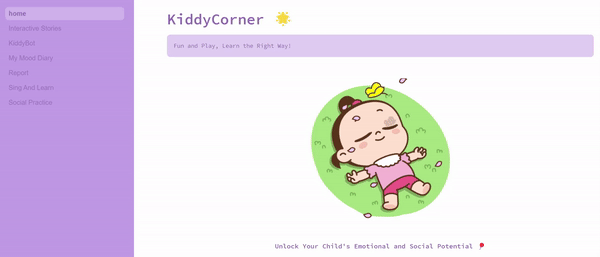

# KiddyCorner 🌟

*Where Fun and Learning Go Hand in Hand!*



*Unlock Your Child's Emotional and Social Potential 🎈*

Welcome to *KiddyCorner*, the ultimate app designed for kids ages 6-10 to explore, understand, and express their emotions while having fun! Our goal is to help children develop emotional intelligence and essential social skills through engaging activities, games, and exercises. Let’s make learning about feelings a joyful experience for kids and a helpful tool for parents! 🌟

## 🚀 Features

- *Practice Talking:* Learn communication and express yourself through interactive conversations.
- *Mindful Journaling:* Share your mood and engage in mindfulness exercises to enhance emotional well-being.
- *Interactive Stories:* Use your imagination to complete fun stories and learn valuable lessons.
- *Social Practice:* Discover how to handle various social situations through enjoyable activities.
- *Sing and Learn:* Sing along with fun songs that make learning enjoyable and memorable.
- *Detailed Reports:* Parents can monitor their child's progress and gain insights into their emotional and social development.

## 💡 Why Choose KiddyCorner?

- *Designed for Young Minds 🧠:* Age-appropriate content that resonates with children ages 6-10.
- *Fun and Interactive 🎉:* Merges play with learning for an engaging and dynamic experience.
- *Supports Emotional Growth 💖:* Helps kids manage, express, and understand their emotions effectively.
- *Personalized Learning 🧩:* Tailored experiences based on each child’s unique interactions and needs.
- *Encourages Social Skills 🌍:* Teaches essential skills for building positive relationships and empathy.

## 📥 Installation

To get started with KiddyCorner, follow these steps:

1. Clone the repository:
    
    ```bash
    git clone https://github.com/MelekMessoussi/kiddycorner.git
    ```
    
2. Navigate to the project directory:
    
    ```bash
    cd kiddycorner
    ```
    
3. Install the required dependencies:
    
    ```bash
    pip install -r requirements.txt
    ```

## 🎬 Demo

Check out our [demo](URL-to-Demo-Link) to see KiddyCorner in action!

## 🤝 Contributing

We welcome contributions to KiddyCorner! If you'd like to contribute, please follow these guidelines:

1. Fork the repository.
2. Create a new branch.
3. Make your changes and commit them.
4. Open a pull request describing your changes.

## 🐛 Issues

If you encounter any issues or have suggestions, please open an issue on GitHub.

## 📄 License

This project is licensed under the [MIT License](LICENSE).


## 🎉 Special Mention

This project was created as part of the Falcon Hackathon organized by Lablab.ai. We are excited to share our innovative solution with the community and contribute to the event's success!


## ⚠️ Limitations

Currently, KiddyCorner uses Eleven Labs for text-to-speech functionality. Please note that Eleven Labs offers a free trial, and we are unable to purchase a paid plan due to country-specific limitations. This may impact the availability of text-to-speech features depending on the trial’s usage limits.
